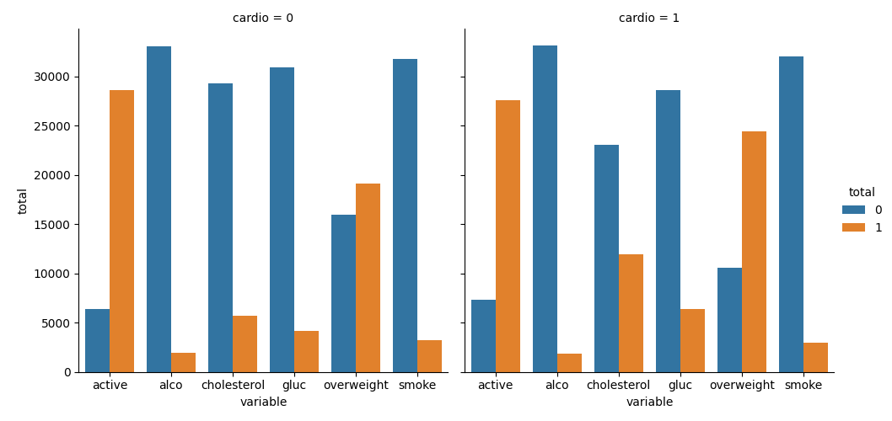
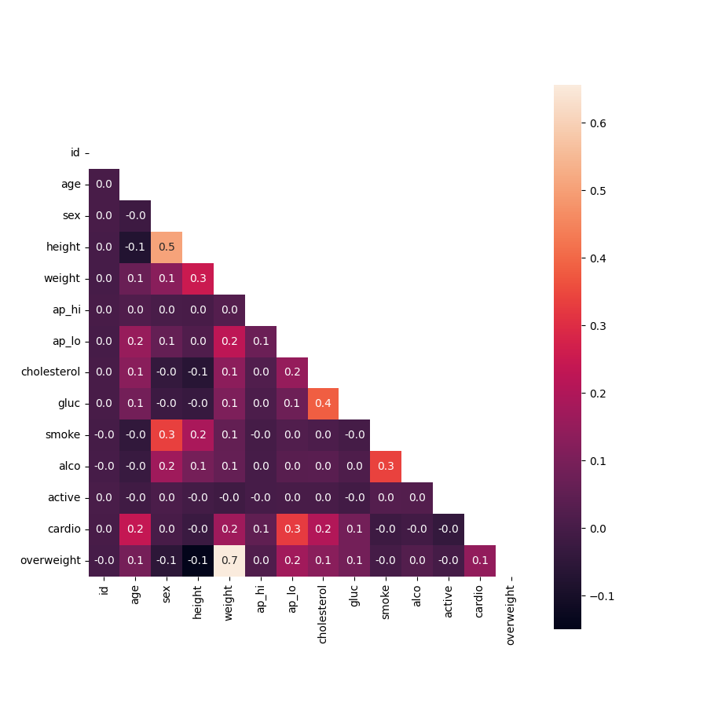

# FCC_Medical_Data_Visualizer
Medical Data Visualizer Project for FCC Data Analysis with Python Certification

## Run Locally

1. Clone the project

```bash
  git clone https://github.com/sameeksha15/FCC_Medical_Data_Visualizer.git
```

2. Go to the project directory

```bash
  cd FCC_Medical_Data_Visualizer
```

3. Create virtual environment 

```bash
  python -m venv venv
```

4. Activate virtual environment

- For Windows
```bash
  .\venv\Scripts\activate
```

- For Unix
```bash
  ./venv/bin/activate
```

5. Install dependencies

```bash
  pip install -r requirements.txt
```

6. Run the script

```bash
  python main.py
```
## Dataset

|index|id|age|sex|height|weight|ap\_hi|ap\_lo|cholesterol|gluc|smoke|alco|active|cardio|
|---|---|---|---|---|---|---|---|---|---|---|---|---|---|
|0|0|18393|2|168|62\.0|110|80|1|1|0|0|1|0|
|1|1|20228|1|156|85\.0|140|90|3|1|0|0|1|1|
|2|2|18857|1|165|64\.0|130|70|3|1|0|0|0|1|
|3|3|17623|2|169|82\.0|150|100|1|1|0|0|1|1|
|4|4|17474|1|156|56\.0|100|60|1|1|0|0|0|0|

<br/>

## OUTPUT 

- Catplot for value counts of the categorical features
<br/>

[]()

<br/>
<br/>

- Heatmap of correlation between the features
<br/>

[]()
